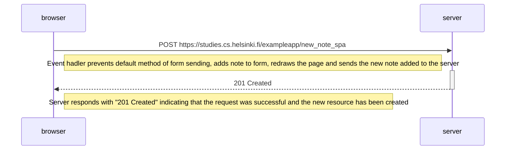

```mermaid
sequenceDiagram
participant browser
participant server

browser->>server: POST https://studies.cs.helsinki.fi/exampleapp/new_note_spa

Note right of browser: Event hadler prevents default method of form sending, adds note to form, redraws the page and sends the new note added to the server

activate server
server-->>browser: 201 Created
deactivate server

Note right of browser: Server responds with "201 Created" indicating that the request was successful and the new resource has been created
```